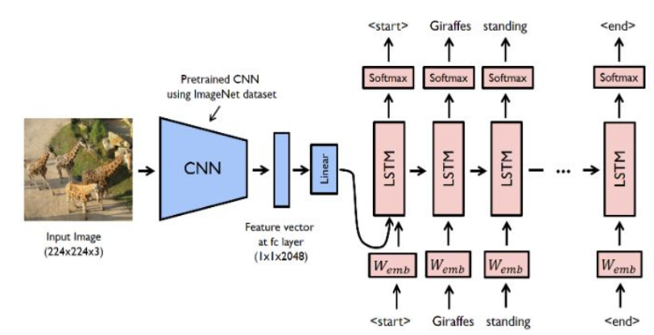

# Image Captioning
The goal of image captioning is to convert a given input image into a natural language description. The encoder-decoder framework is widely used for this task. The image encoder is a convolutional neural network (CNN). In this tutorial, we used both [resnet-152](https://arxiv.org/abs/1512.03385) model pretrained on the [ILSVRC-2012-CLS](http://www.image-net.org/challenges/LSVRC/2012/) image classification dataset and pretrained vgg16 and compared both the results. As it takes very long time to load pretrained resnet 152 and to train the last fc layer of it on such huge COCO dataset, I trained only first two batches(shuffle=False) of COCO dataset on pretrained vgg16(as loading time of vgg16 is less than resnet152).Though the accuracy(As expected) is bad,it is just for my understanding and to learn how things actually work while training a model.At the end, I attached a link to trained(on whole COCO dataset) encoder and decoder model, to compare the results between encoder-decoder model(trained on only 2 batches)(where encoder is vgg16) and the actual encoder-decoder model(trained on whole COCO dataset)(where encoder is resnet 152). The decoder is a long short-term memory (LSTM) network. 



#### Training phase
For the encoder part, the pretrained CNN extracts the feature vector from a given input image. The feature vector is linearly transformed to have the same dimension as the input dimension of the LSTM network. For the decoder part, source and target texts are predefined. For example, if the image description is **"Giraffes standing next to each other"**, the source sequence is a list containing **['\<start\>', 'Giraffes', 'standing', 'next', 'to', 'each', 'other', '\<end\>']** and the target sequence is a list containing **['\<start\>', 'Giraffes', 'standing', 'next', 'to', 'each', 'other', '\<end\>']**. Using these source and target sequences and the feature vector, the LSTM decoder is trained as a language model conditioned on the feature vector.

#### Test phase
In the test phase, the encoder part is almost same as the training phase. The only difference is that batchnorm layer uses moving average and variance instead of mini-batch statistics. This can be easily implemented using [encoder.eval()](https://github.com/AlekhyaCholleti/image_captioning_cocodataset_pytorch/blob/master/sample.py#36). For the decoder part, there is a significant difference between the training phase and the test phase. In the test phase, the LSTM decoder can't see the image description. To deal with this problem, the LSTM decoder feeds back the previosly generated word to the next input. This can be implemented using a [for-loop](https://github.com/AlekhyaCholleti/image_captioning_cocodataset_pytorch/blob/master/model.py#45).


## Usage 


#### 1. Clone the repositories
```bash
$ git clone https://github.com/pdollar/coco.git
$ cd coco/PythonAPI/
$ make
$ python setup.py build
$ python setup.py install
$ cd ../../
$ git clone https://github.com/AlekhyaCholleti/image_captioning_cocodataset_pytorch
```

#### 2. Download the dataset

```bash
$ pip install -r requirements.txt
$ chmod +x download.sh
$ ./download.sh
```

#### 3. Preprocessing

```bash
$ python build_vocab.py   
$ python resize.py
```

#### 4. Train the model

```bash
$ python train_resnet152.py  #train model having resnet152 as encoder
$ python train_vgg16.py  #train(only on 2 batches) model having vgg16 as encoder

```

#### 5. Test the model 

```bash
$ python sample.py --image='png/example.png'  #test model having resnet152 as encoder
$ python sample_vgg16.py --image='png/example.png'  #test model having vgg16(trained only on 2 batches) as encoder
```

<br>

## Pretrained model
If you do not want to train the model from scratch, you can use the pretrained model. You can download the pretrained model(having resnet152 as encoder) [here](https://drive.google.com/drive/folders/1f2YsGpUavyBGUfqxb0hlrbmnqkJShkI7?usp=sharing) and the vocabulary file [here](https://drive.google.com/file/d/1SDKBHpEhr8NwvH6ORS5xWyro-t0lQyuX/view?usp=sharing). 
You should extract pretrained_model.zip to `./models/` and vocab.pkl to `./data/` using `unzip` command.
